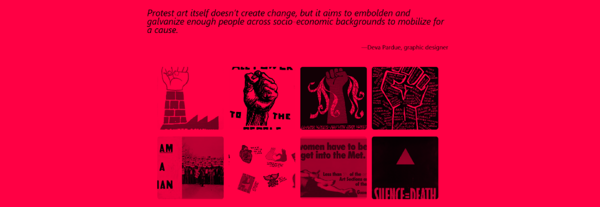

# Radical Gallery

Create your own, simple image gallery and host it for free on [neocities.org](https://neocities.org/).

There are two versions of this project:

- an HTML version that might be more suitable for people less familiar with web development
- an version that uses the [11ty static site generetor](https://www.11ty.dev/) and requires using a [command line](https://en.wikipedia.org/wiki/Command-line_interface)

## HTML Version

Follow the tutorial [on my blog](https://stefanbohacek.com/blog/making-a-free-image-gallery-with-neocities-org/).

## 11ty Version

See the [11ty](https://github.com/stefanbohacek/radical-gallery/tree/main/11ty) folder in this repo and follow [this tutorial](TBD).
